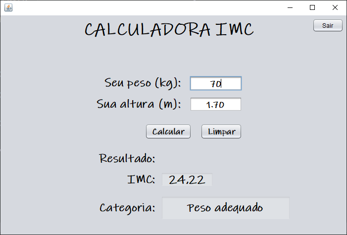

# Calculadora de IMC

> Calculadora de IMC - Aplicação para cálculo e classificação do IMC.

⚖ Projeto criado para aprendizagem em Java utilizando Swing ⚖

[🔗 Clique aqui para acessar.](https://danielkistemacher.github.io/Calculadora-IMC/)

## 🛠 Tecnologias

- Java
- Swing
- Git e GitHub

## ⚠ Informações do projeto

- Tela inicial contendo as opções para:  
    -> Informar o peso. 
    -> Informar a altura. 
    -> Resultado do cálculo. 
    -> Classificação do IMC com base no resultado. 
 

## ✉ Contato
E-mail: danielkistemacher@gmail.com  
LinkedIn: https://www.linkedin.com/in/daniel-kistemacher-da-silva-525422219/